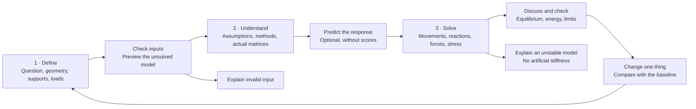
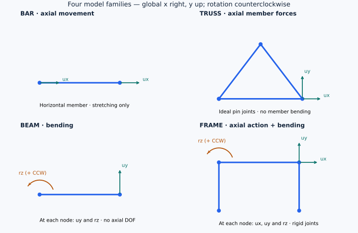
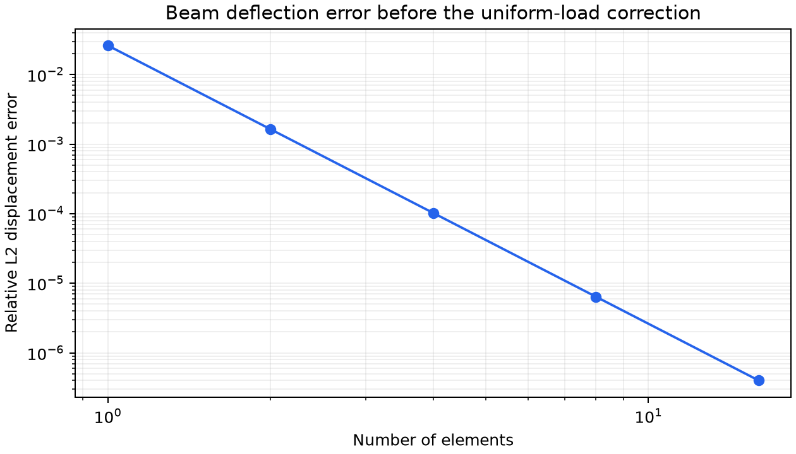

# Python-FEM-Structural-Solver

**Learn how a structure becomes a set of equations, solve it on your own PC, and check the answer.**

[Public source repository](https://github.com/md-ishtiak-ahmed-sajib/Python-FEM-Structural-Solver) · [Installation](docs/02-getting-started/installation.md) · [Evidence and limits](docs/07-testing-and-evidence/evidence-status.md)

This Python project solves 1D bars, 2D trusses, Euler–Bernoulli beams and 2D frames. It shows movements, support reactions, member forces and normal stresses. You can inspect the calculation rather than seeing only a final number.

A second part asks whether a few beam-deflection measurements can separate beam stiffness from clamp flexibility. Current research results use **synthetic data generated from equations**. Real bench measurements are still pending.

## Start with your question

| Your question | Start here |
|---|---|
| What have we built, and why? | [Project vision and goals](docs/01-project-vision/vision-and-goals.md) |
| How do I run it? | [Installation](docs/02-getting-started/installation.md) |
| Can I understand one result by hand? | [Your first bar calculation](docs/02-getting-started/first-model.md) |
| What does FEM mean? | [FEM basics](docs/03-engineering-knowledge/fem-basics.md) and [glossary](docs/03-engineering-knowledge/glossary.md) |
| How does the app work? | [App guide](docs/04-user-guide/app-guide.md) |
| What is the research question? | [Beam stiffness and clamp flexibility](docs/05-research-and-experiments/research-question.md) |
| What evidence can I trust? | [Tests and evidence status](docs/07-testing-and-evidence/evidence-status.md) |
| How can I help? | [Student and developer contributions](docs/08-contributing-and-release/how-to-contribute.md) |

## What the project provides

| Part | What you can do |
|---|---|
| Structural solver | Define nodes, members, materials, sections, supports and loads |
| Local browser app | Edit models, inspect results, view matrices and run the stiffness study |
| Engineering explanations | Learn units, signs, equations and worked examples |
| Repeatable studies | Rebuild synthetic results with saved settings and random seeds |
| Measurement workflow | Import actual readings and test details when they become available |
| Exports | Save JSON, CSV, figures and self-contained interactive HTML |

The calculation engine is written directly in this repository. NumPy and SciPy provide numerical tools. OpenSees is a separate comparison program, not the engine behind the app.

The mathematics is established. The contribution is the connected code, clear explanations, tests and repeatable study. Read the [sources](docs/03-engineering-knowledge/references.md) and [AI-assistance record](docs/08-contributing-and-release/ai-and-authorship.md).

## Learn by defining, explaining and checking a problem

The app starts with a three-stage route. Experienced users can choose **Direct access**. Hover, focus or tap dotted technical terms for simple explanations, or search the glossary.

First define the problem. Then inspect its method and predict its behavior. Finally solve, check the answer, and compare one changed input. Saving a draft does not solve it. For a selected portion of a structure, explain the forces and restraints at its cut boundaries.

This diagram shows model behavior, not a complete support arrangement or a safe design. All nodes in each family have the stated movements. Read [how to approach a structural problem](docs/03-engineering-knowledge/problem-solving.md) and [the app guide](docs/04-user-guide/app-guide.md).

## Mathematics inside the engine

FEM connects movements to forces through stiffness. The assembled system includes support springs. We solve only the unknown movements after inserting the known ones:

$$
K_{\mathrm{total}}u=F+R_c,
\qquad K_{ff}u_f=F_f-K_{fc}u_c.
$$

Here, **f** means free and **c** means prescribed. The solver uses sparse factorization; it does not calculate an explicit inverse of K. Read the [full derivations and numerical rules](docs/03-engineering-knowledge/numerical-methods.md).

| Symbol | Simple meaning | Internal SI unit |
|---|---|---|
| E | Material stiffness, or Young's modulus | Pa = N/m² |
| A | Cross-section area | m² |
| I | Second moment of area about the bending axis | m⁴ |
| L, x | Element length and distance from its start | m |
| u, v, θ | Axial movement, transverse movement, rotation | m, m, rad |
| EA, EI | Axial rigidity and bending rigidity | N, N m² |
| qx, qy | Uniform member loads in local directions | N/m |
| N, V, M | Axial force, shear force, bending moment | N, N, N m |
| cₛ | Section fiber distance used for bending stress | m |
| C | Rotational clamp compliance in the study | rad/(N m) |

Global x points right, y points up, and positive rotation is counterclockwise. Local x points from the member's start node to its end. Axial tension and sagging moment are positive. The study separately uses downward-positive force and deflection. See [units and signs](docs/03-engineering-knowledge/units-and-signs.md).

Element equations: bar, truss, beam and frame

**Bar.** Its local movement vector is $d=[u_1,u_2]^{\mathsf T}$:

$$
k_{\mathrm{axial}}=\frac{EA}{L}
\begin{bmatrix}1&-1\\-1&1\end{bmatrix},
\qquad \epsilon=\frac{u_2-u_1}{L},\qquad \sigma=E\epsilon.
$$

This stiffness relation is the axial part used by bars, trusses and frames. The constant strain expression describes linear interpolation. A uniform axial load also needs the load and interior-field terms below to recover the varying strain and stress.

**Truss.** For angle α from global x, let $c_\alpha=\cos\alpha$ and $s_\alpha=\sin\alpha$. These direction numbers are different from the section fiber distance:

$$
T=\begin{bmatrix}c_\alpha&s_\alpha&0&0\\0&0&c_\alpha&s_\alpha\end{bmatrix},
\qquad d=T u_e,\qquad K_e=T^{\mathsf T}k_{\mathrm{axial}}T.
$$

The global element vector is $u_e=[u_{x1},u_{y1},u_{x2},u_{y2}]^{\mathsf T}$. A truss member has no bending stiffness.

**Euler–Bernoulli beam.** The local order is $d=[v_1,\theta_1,v_2,\theta_2]^{\mathsf T}$, with $\theta=dv/dx$:

$$
k_{\mathrm{bend}}=\frac{EI}{L^3}
\begin{bmatrix}
12&6L&-12&6L\\
6L&4L^2&-6L&2L^2\\
-12&-6L&12&-6L\\
6L&2L^2&-6L&4L^2
\end{bmatrix}.
$$

With $t=x/L$, the cubic Hermite functions are:

$$
H=\begin{bmatrix}1-3t^2+2t^3&L(t-2t^2+t^3)&3t^2-2t^3&L(-t^2+t^3)\end{bmatrix},
\qquad v_h=Hd.
$$

$$
k_{\mathrm{bend}}=\int_0^L EI\,(H'')^{\mathsf T}H''\,dx.
$$

**Frame.** Use $d=[u_1,v_1,\theta_1,u_2,v_2,\theta_2]^{\mathsf T}$. Insert the axial block at zero-based positions [0,3] and the bending block at [1,2,4,5]. Each node uses the rotation below; the full T has two such diagonal blocks:

$$
R=\begin{bmatrix}c_\alpha&s_\alpha&0\\-s_\alpha&c_\alpha&0\\0&0&1\end{bmatrix},
\qquad T=\operatorname{diag}(R,R),\qquad K_e=T^{\mathsf T}k_eT.
$$

Assembly, loads, recovery and numerical checks

The mapping $P_e$ selects an element's global DOFs from the full vector. Contributions at shared DOFs are added. Ground springs form the diagonal matrix $K_s$:

$$
K_{\mathrm{total}}=\sum_e P_e^{\mathsf T}T_e^{\mathsf T}k_eT_eP_e+K_s,
\qquad F=F_{\mathrm{nodal}}+\sum_e P_e^{\mathsf T}T_e^{\mathsf T}f_{\mathrm{eq},e}.
$$

A constant local transverse load has the beam equivalent end-load vector:

$$
f_{\mathrm{eq,bend}}=
\begin{bmatrix}q_yL/2&q_yL^2/12&q_yL/2&-q_yL^2/12\end{bmatrix}^{\mathsf T}.
$$

A constant local axial load contributes $q_xL/2$ to each axial end DOF. Recover local end actions with $f_e=k_ed-f_{\mathrm{eq},e}$. From the start-end components:

$$
N(x)=-f_{i,u}-q_xx,\qquad
V(x)=f_{i,v}+q_yx,\qquad
M(x)=-f_{i,\theta}+f_{i,v}x+\frac{q_yx^2}{2}.
$$

Thus $V=dM/dx$. Normal stress is:

$$
\sigma_{\mathrm{top}}=\frac{N}{A}-\frac{Mc_s}{I},\qquad
\sigma_{\mathrm{bottom}}=\frac{N}{A}+\frac{Mc_s}{I}.
$$

The engine reports bending stress only when the section fiber distance is supplied. These are section stresses, not detailed stresses around a joint.

For constant member properties, the recovered fields include uniform-load corrections that preserve the end values:

$$
v(x)=H(x)d+\frac{q_yx^2(L-x)^2}{24EI},\qquad
u(x)=\left(1-\frac{x}{L}\right)u_1+\frac{x}{L}u_2+\frac{q_xx(L-x)}{2EA}.
$$

Reactions use the original system. $R_c$ is zero at free DOFs; spring reactions are reported separately:

$$
(R_c)_c=(K_{\mathrm{total}}u-F)_c,\qquad R_s=-K_su.
$$

The discrete energy and work check are:

$$
U_h=\frac12u^{\mathsf T}K_{\mathrm{total}}u,\qquad
2U_h=u^{\mathsf T}(F+R_c).
$$

This checks the nodal stiffness system, including springs. It is not an integration of the enriched interior displacement field. Prescribed support movements can do work, so they must not be omitted. External force and moment balance include applied loads, prescribed reactions and spring reactions.

Research equation: separate beam bending from clamp rotation

For downward force P at distance a from a nontranslating clamp, the downward deflection at x is:

$$
v(x)=\frac{P B(x,a)}{EI}+PaxC,\qquad
B(x,a)=\begin{cases}x^2(3a-x)/6,&x\le a\\a^2(3x-a)/6,&x\ge a.\end{cases}
$$

The first term is beam bending; the second is clamp rotation. The fit uses scaled parameters $\beta=EI_{\mathrm{ref}}/EI$ and $\gamma=EI_{\mathrm{ref}}C/L$ with bounded weighted least squares. Each observation is weighted by its stated uncertainty. Sensitivity, rank and uncertainty checks determine whether the measurements can separate the parameters.

Bending measurements identify effective EI, not E and I independently. The results do not prove damage. Read the [research question and limits](docs/05-research-and-experiments/research-question.md).

## A benchmark you can reproduce

This numerical benchmark measures the **cubic Hermite displacement field before the exact uniform-load correction** against the analytical quartic cantilever solution. It does not claim that an already exact corrected field improves with more elements. The relative error has no unit:

$$
e_{L^2}=\frac{\sqrt{\int_0^L(v_h-v_{\mathrm{exact}})^2\,dx}}{\sqrt{\int_0^L v_{\mathrm{exact}}^2\,dx}}.
$$

The stored error falls from about 0.0262 with one element to $4.00\times10^{-7}$ with sixteen. Read the [benchmark data](reports/verification/convergence.json), [generation script](scripts/reproduce_artifacts.py) and [verification guide](docs/07-testing-and-evidence/verification.md). Rebuild just this benchmark with `python -c "from scripts.reproduce_artifacts import convergence; convergence()"`.

| Independent numerical comparison | Recorded outcome |
|---|---|
| Axial bar | Passed |
| Triangular truss | Passed |
| Cantilever beam | Passed |
| Portal frame | Passed |
| Beam with rotational support spring | Passed |

These outcomes come from the separate [OpenSees comparison record](reports/verification/opensees.json). They check matching mathematical models, not physical specimens. Displacement, rotation, force and moment errors are not combined here into one mixed-unit graph.

## Run on Windows

Open PowerShell in this folder. Python 3.12 is the tested version.

~~~powershell
py -3.12 -m venv .venv
.\.venv\Scripts\python -m pip install -r requirements.lock
.\.venv\Scripts\python -m pip install -e . --no-deps
.\.venv\Scripts\python -m streamlit run app.py
~~~

Then open [the local app](http://127.0.0.1:8501). After installation, [run-local.cmd](run-local.cmd) starts it again.

Installation needs internet. Normal calculations and exports use local files afterward. No account, GPU or API key is needed. See [installation details](docs/02-getting-started/installation.md) and [offline check limits](docs/07-testing-and-evidence/verification.md).

## What has been checked?

The current suite has **81 passing tests**, including guided workflows for all four element families. The shared glossary has **99 plain-English terms**. The project also includes OpenSees comparisons, a separate wheel-installation check and the full synthetic study. Read the [check scope](docs/07-testing-and-evidence/evidence-status.md) before interpreting these records.

The study has 2,304 configurations and 200 planned trials per configuration. It reports insufficient-information cases instead of inventing unique estimates.

| Status | Meaning |
|---|---|
| Software implemented and checked | The recorded numerical and app checks passed |
| Synthetic study completed | Results come from equations, with saved settings |
| Physical validation pending | No real beam-test agreement is claimed |
| External reproduction pending | No run by another person is recorded |
| Public GitHub repository | [Source, issues and releases are available on GitHub](https://github.com/md-ishtiak-ahmed-sajib/Python-FEM-Structural-Solver) |

Read the [check record](reports/verification/software_checks.json), [research report](docs/05-research-and-experiments/research-report.md) and [full evidence explanation](docs/07-testing-and-evidence/evidence-status.md).

This is educational and research software. It does not check design codes or certify a structure as safe.

## Find files and learn in a useful order

~~~text
docs/
  01-project-vision/             Why, goals, requirements and features
  02-getting-started/            Installation and first model
  03-engineering-knowledge/      Concepts, equations, units and examples
  04-user-guide/                 App, Python, files and troubleshooting
  05-research-and-experiments/   Study question, protocol and results
  06-software-design/            Code structure and design decisions
  07-testing-and-evidence/       Checks and what they prove
  08-contributing-and-release/  Ways to help and share the work
  09-project-records/            Milestones and current state
~~~

Use the [documentation map](docs/README.md) for reading paths and the [repository map](docs/02-getting-started/project-map.md) for code, data and output folders.

The [26-week guide](docs/03-engineering-knowledge/learning-guide.md) is optional study material. It does not control development dates.

## Complete documentation index

Every documentation page is linked below. Each topic also links back here, to its section guide and to related pages.

01-project-vision: Project vision

- [Section guide](docs/01-project-vision/README.md)
- [Why we built this project](docs/01-project-vision/vision-and-goals.md)
- [What the software must do](docs/01-project-vision/requirements.md)
- [Features and their current status](docs/01-project-vision/features.md)

02-getting-started: Getting started

- [Section guide](docs/02-getting-started/README.md)
- [Install and run the project](docs/02-getting-started/installation.md)
- [Your first bar calculation](docs/02-getting-started/first-model.md)
- [Where files and folders belong](docs/02-getting-started/project-map.md)

03-engineering-knowledge: Engineering knowledge

- [Section guide](docs/03-engineering-knowledge/README.md)
- [FEM explained from the beginning](docs/03-engineering-knowledge/fem-basics.md)
- [How to approach a structural problem](docs/03-engineering-knowledge/problem-solving.md)
- [Units, axes, supports and signs](docs/03-engineering-knowledge/units-and-signs.md)
- [Bar and beam calculations by hand](docs/03-engineering-knowledge/worked-examples.md)
- [Equations used in the solver](docs/03-engineering-knowledge/numerical-methods.md)
- [Engineering and software glossary](docs/03-engineering-knowledge/glossary.md)
- [Optional 26-week learning guide](docs/03-engineering-knowledge/learning-guide.md)
- [Books, lessons, papers and related software](docs/03-engineering-knowledge/references.md)

04-user-guide: User guide

- [Section guide](docs/04-user-guide/README.md)
- [Use the three-stage learning app](docs/04-user-guide/app-guide.md)
- [Python functions and model files](docs/04-user-guide/python-and-json.md)
- [Save results and run commands](docs/04-user-guide/exports.md)
- [Understand errors and unexpected results](docs/04-user-guide/troubleshooting.md)

05-research-and-experiments: Research and experiments

- [Section guide](docs/05-research-and-experiments/README.md)
- [Understand the stiffness research question](docs/05-research-and-experiments/research-question.md)
- [Repeat the synthetic study](docs/05-research-and-experiments/study-protocol.md)
- [Prepare and process real measurements](docs/05-research-and-experiments/bench-protocol.md)
- [Read the generated research report](docs/05-research-and-experiments/research-report.md)

06-software-design: Software design

- [Section guide](docs/06-software-design/README.md)
- [How the code is organized](docs/06-software-design/architecture.md)
- [Rules for a clear interface](docs/06-software-design/interface-design.md)
- [Rules for reliable changes](docs/06-software-design/development-rules.md)
- [Design decision guide](docs/06-software-design/decisions/README.md)
- [Decision 1: local Python and browser app](docs/06-software-design/decisions/ADR-0001-local-python.md)
- [Decision 2: fit compliance](docs/06-software-design/decisions/ADR-0002-compliance-identification.md)

07-testing-and-evidence: Testing and evidence

- [Section guide](docs/07-testing-and-evidence/README.md)
- [Run tests and compare results](docs/07-testing-and-evidence/verification.md)
- [What has and has not been checked](docs/07-testing-and-evidence/evidence-status.md)
- [Plan audit and remaining reviews](docs/07-testing-and-evidence/acceptance-review.md)

08-contributing-and-release: Contributing and release

- [Section guide](docs/08-contributing-and-release/README.md)
- [Contribute as a student or developer](docs/08-contributing-and-release/how-to-contribute.md)
- [Explain authorship and AI assistance](docs/08-contributing-and-release/ai-and-authorship.md)
- [Prepare a release or project presentation](docs/08-contributing-and-release/release-guide.md)

09-project-records: Project records

- [Section guide](docs/09-project-records/README.md)
- [Completed work and next milestones](docs/09-project-records/milestones.md)
- [Current project state](docs/09-project-records/working-memory.md)
- [Keep pages clear, linked and up to date](docs/09-project-records/documentation-guide.md)

## Project rules and records

- [Contribution entry point](CONTRIBUTING.md).
- [Security and safe use](SECURITY.md).
- [Third-party tools](THIRD_PARTY.md).
- [Changelog](CHANGELOG.md).
- [Instructions for coding assistants](AGENTS.md).
- [MIT software license](LICENSE) and [citation details](CITATION.cff).

The MIT License is the name of a software license. It does not imply university endorsement or an admissions result.
