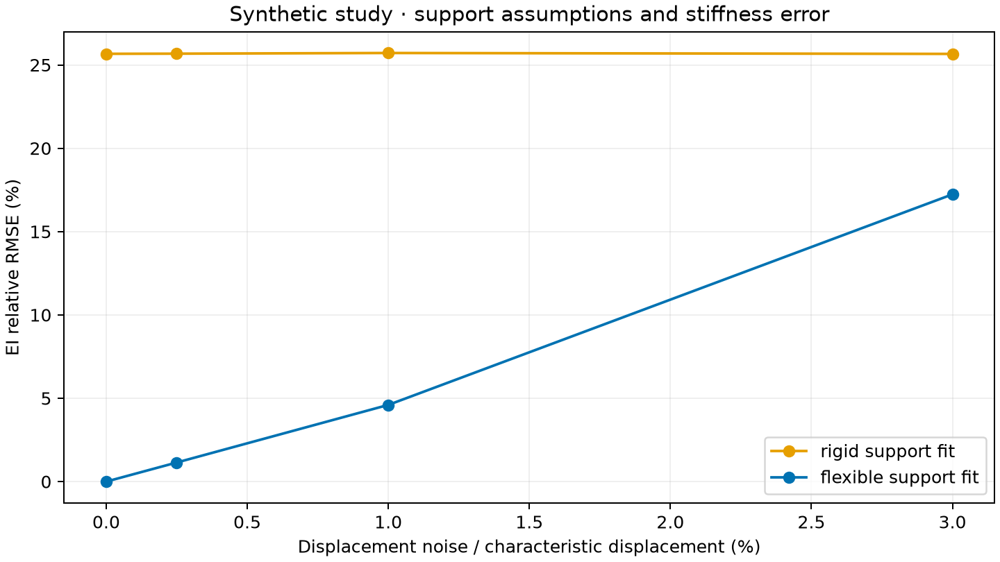

# Read the generated research report

[Project home](../../README.md) · [Documentation map](../README.md) · [Research guide](README.md)

**Data source: synthetic.** All observations in this report came from equations. No real beam measurements or reproduction by another person are claimed.

## What we asked

Can a few static beam-deflection observations separate beam bending stiffness EI from rotational clamp compliance C?

A clamp that rotates can make a beam appear more flexible. If the model assumes a perfectly rigid clamp, it may compensate by estimating an EI that is too low.

This is an established structural-identification problem. Our contribution is the connected software, open settings, clear failure cases and repeatable results.

## Read this before the numbers

EI is E multiplied by I. These observations do not identify E and I separately.

C is rotation per unit moment at the clamp. The fitted model assumes the clamp does not translate. For a downward load P at a and an observation at x:

~~~text
v(x) = P B(x,a)/EI + P a x C
~~~

The [equation guide](../03-engineering-knowledge/numerical-methods.md) defines B. The [simple research explanation](research-question.md) explains why one sensor can be ambiguous.

## How the study was run

The [study protocol](study-protocol.md) specifies 2,304 configurations and 200 planned repeats per configuration, using random seed 2027.

Of these, 192 configurations lacked enough independent information and received no estimates. The study estimated parameters in 422,400 trials.

The study compares four slenderness ratios, three clamp-flexibility values, four sensor layouts, three load patterns and four noise levels. It generates data using separate Euler–Bernoulli and Timoshenko formulas. Timoshenko includes shear deformation; the fitted beam model does not.

The large study uses analytical influence functions and a fast bounded fitting method checked against SciPy. The app normally obtains its influence functions from FEM calculations. Tests compare the analytical and FEM versions.

Sensor selection uses the assumed model before fitting. Reserved load cases do not influence the fit. Both support models receive the same observations in a configuration.

The added noise is independent and Gaussian. Its size is a percentage of the stated characteristic displacement. At 0% noise, no perturbation is added. Force and geometry are exact in this synthetic study.

## One planned comparison

This table selects L/h=20, gamma=0.1, four sensors, varied training load positions and Euler–Bernoulli-generated observations. The numbers come from the saved output.

**Bias** is average signed error. A negative EI bias means underestimation. **RMSE** measures typical error size. The last column compares reserved-case movement errors with the characteristic displacement.

| Noise | Fitted support | EI relative bias | EI relative RMSE | Reserved-case normalized RMSE |
|---|---|---|---|---|
| 0% | rigid | -25.66589% | 25.66589% | 2.64511% |
| 0% | flexible | -0.00000% | 0.00000% | 0.00000% |
| 0.25% | rigid | -25.67332% | 25.67365% | 2.64334% |
| 0.25% | flexible | 0.01755% | 1.14497% | 0.09776% |
| 1% | rigid | -25.70984% | 25.71362% | 2.63568% |
| 1% | flexible | -0.23800% | 4.60043% | 0.38672% |
| 3% | rigid | -25.61589% | 25.65995% | 2.68325% |
| 3% | flexible | 3.60661% | 17.23333% | 1.16669% |

In the zero-noise row shown here, the rigid-support fit underestimates EI, while the flexible-support fit recovers the chosen synthetic parameters closely. In this selected comparison, larger noise increases the flexible fit's error. This is not a guarantee for every configuration or real specimen.

Read the full [summary CSV](../../reports/synthetic/summary.csv) and [settings file](../../reports/synthetic/manifest.json), not only this figure.

A flexible fit has an extra unknown. Compare uncertainty and reserved-case error as well as agreement on training observations. Differences with Timoshenko-generated data can reveal missing shear effects; they are not automatically an error in the Euler–Bernoulli code.

## A useful failure case

One sensor with one load position and repeated load magnitudes is a negative control: a case expected to lack enough information.

Increasing force scales both bending and clamp rotation together. The sensitivity rows remain proportional. The software reports that it cannot give a unique two-parameter estimate.

Failure to identify the parameters is a useful result, not a reason to hide the case.

## Checks against known answers

[OpenSees results](../../reports/verification/opensees.json) contain matching bar, truss, beam, frame and spring comparisons, plus Timoshenko references.

Automatic tests also check reactions, work, units, member directions and invalid models. See [verification](../07-testing-and-evidence/verification.md).

## Does a finer mesh reduce approximation error?

The table below measures the cubic Hermite displacement field before the exact uniform-load correction. It compares that field with the analytical quartic solution.

The exported field already includes the correction for this uniform-beam case. Testing that corrected field would not be a meaningful demonstration of convergence.

| Elements | Relative L2 error of the cubic field |
|---|---|
| 1 | 2.62059870e-02 |
| 2 | 1.63792734e-03 |
| 4 | 1.02371289e-04 |
| 8 | 6.39821860e-06 |
| 16 | 3.99889290e-07 |

Relative L2 error compares the size of the error over the beam with the size of the exact deflection field. The results show how this particular interpolation error decreases with a finer mesh.

## How much confidence should we place in estimates?

The app uses repeated simulated observations, called a parametric bootstrap, to report approximate intervals. The intervals depend on the beam model, fixed geometry and force values, and independent Gaussian measurement errors.

They do not include unknown zero drift, force error, dimension error, clamp translation or all effects missing from the model.

Near a rigid clamp, the compliance interval may include zero. Report a compliance range. Do not turn a near-zero estimate into a falsely precise very large spring stiffness.

Full sensitivity rank is necessary for a unique fit, but it does not guarantee useful precision. Strong parameter correlation or wide intervals can still make estimates weak.

## Physical work is still pending

The [bench protocol](bench-protocol.md) covers specimen measurements, a secure fixture, calibration, zero readings, repeated loading, remounting and reserved prediction cases.

The CSV importer and report writer are ready. Empty templates do not count as data. A later small experimental residual would still not prove that the clamp is a linear rotational spring.

No damage detection or structural safety conclusion is made.

## Repeat this report

From the project root, run python scripts/reproduce_artifacts.py in the installed full environment. Run the OpenSees script in its separate environment.

Software version: 0.1.0. Python: 3.12.10. Platform: Windows AMD64.

Core-source SHA-256: f9ba8f4d6a1af2a44fb3416d89b6f5663e9951a5f502ef54f9f7d705d4e18e02.

The hash is a fingerprint of the source files used for this report. It helps detect changes; it is not evidence of physical correctness.

## Read next

- [Study protocol](study-protocol.md).
- [Bench preparation](bench-protocol.md).
- [What the evidence supports](../07-testing-and-evidence/evidence-status.md).
- [Sources](../03-engineering-knowledge/references.md) and [AI assistance](../08-contributing-and-release/ai-and-authorship.md).
